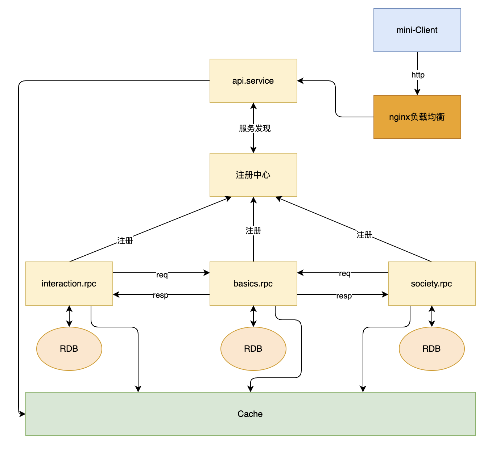

# mini-douyin

奖项源地址: https://p9-juejin.byteimg.com/tos-cn-i-k3u1fbpfcp/dc7356248591460a96584a58fe036546~tplv-k3u1fbpfcp-watermark.image

# 一、项目介绍

抖声APP服务端的设计与实现

[github项目地址](https://github.com/linkXue/mini-douyin)

[项目设计文档](./极简抖音-xys.md)

[飞书答辩文档](https://tmz2eg926y.feishu.cn/docx/RbrldrCGfo3zO2xv5Zbcn6tTn8d?from=space_persnoal_filelist)

[演示视频](https://mini-douyin-basics.oss-cn-nanjing.aliyuncs.com/uservideo/7a4cbe4b128c5f4b5c085a2523c36f60.mp4)

[测试接口文档](https://console-docs.apipost.cn/preview/86470cab8b60e7f1/b2552e1674d9de29?target_id=59b3193a-d504-4efe-957f-90368232e307)

# 二、项目实现

## 2.1 技术选型与相关开发文档

**项目设计要求**

基础功能、互动方向、社交方向

**项目背景**

1. 假设系统有足够多的用户，足够多的访问，单机部署已经难以处理每天的请求数
2. 假设有足够多的机器能够支持微服务的允许
3. 人力资源和时间不够，无法对每个服务足够多的优化

**完成目标**

1. 完成基础功能，两大方向服务
2. 使用微服务方案分担服务的压力
3. 局部性的优化服务性能
4. 安全可靠、稳定运行

**技术选型**

1. go语言
2. Hertz + Kitex + Gorm

## 2.2 架构设计

> 可以补充场景分析环节，明确要解决的问题和前提假设，比如预计0.5%的用户属于大V，粉丝很多，也会经常上传视频，当前架构的解决方案是xxx。

### 2.2.1 微服务设计

一个api服务，三个rpc服务

项目服务

1. api.service：会话服务，api服务，对外提供所有服务功能的api，统一api，屏蔽内部实现细节
2. basics.rpc：基础服务，rpc服务，实现用户和视频的相关服务
3. interaction.rpc：互动服务，rpc服务，实现互动方向的相关服务
4. society.rpc：社交服务，rpc服务，实现社交方向的相关服务

项目其他服务

1. nginx：api.service负载均衡的实现，最终方案：单个nginx
2. 注册中心：注册rpc服务。最终方案：3个etcd模拟集群
3. RDB：数据存储中心。最终方案：mysql
4. Cache：缓存中心。最终方案：redis主从

预计需要很多台机器完成部署，以及成熟的部署框架，但只为了演示微服务集群的效果：

1. api服务和rpc服务各通过换端口号在本地运行两次模拟服务集群
2. nginx单节点在本地运行
3. 在本地换端口号启动3个etcd模拟注册中心集群
4. 三台mysql服务器使用的云服务器，不在本地
5. Cache使用两台redis实现主从，不在本地
